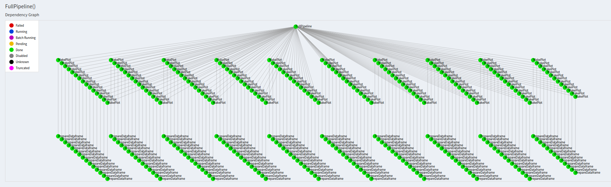

# TASK 4: LUIGI

To run with local scheduler:

python preprocessing.py FullPipeline --local-scheduler

Central scheduler with parallelization (I changed default port in luigi.cfg):

luigid --port 12345 or 
luigid --background --logdir tmp --port 12345

python preprocessing.py FullPipeline --workers 20

Pipeline(localhost:12345):

