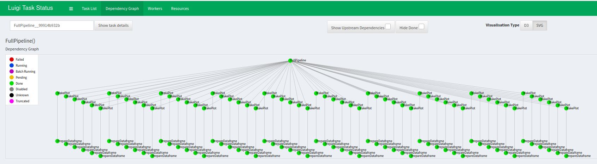

# LUIGI
## In this example a docker container will be built for using Luigi as an orchestrator
## CLI

1) Build an image with human readable name:  
```
docker build -t luigi_image --build-arg USER_ID=$(id -u) --build-arg GROUP_ID=$(id -g) .
```
2) Run a container (Start Luigi's visualizer at port 1111):  
```
docker run -d -v $(pwd)/volume:/home/new_user/volume -p 1111:1111 --name luigi_container luigi_image
```
At this point, you should be able to visit Luigi's visualizer at 0.0.0.0:1111

If you want to start the pipeline, firstly, enter the running container in -it mode:
```
docker exec -it luigi_container bash
```
And then type:
```
cd volume && python pipeline.py --workers 14 --ticker_name AAPL --start_date 2020-10-10
```
Once you've done it, files are being collected and you can see Luigi's pipeline visualization at 0.0.0.0:1111 like:

<p style="text-align:center;">Pipeline(localhost:12345):</p>


     
Don't forget to stop|kill the container, once you've finished Luigi's investigation)
