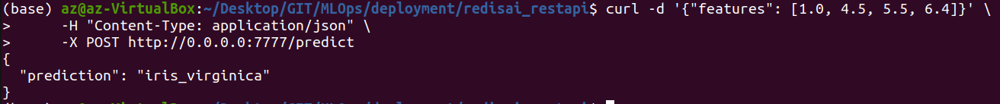
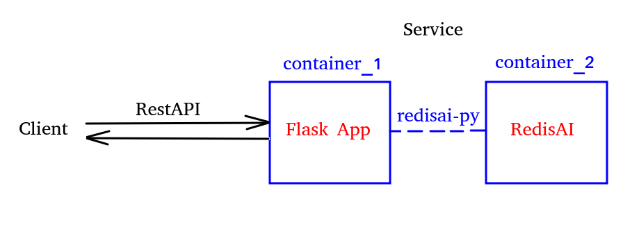
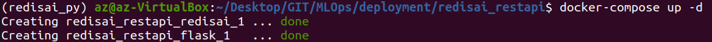
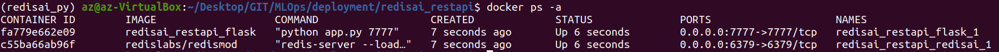

# Model deployment via RestAPI and RedisAI

This is an example of model deployment (ONNX format). A Flask app waits for request from client. Having received input, the app sends input data as a tensor to RedisAI server where a model returns the predicted class (famous species of flower).

You have to provide 4 features for the model as a list with floats.

Feature values: [{sepal_length}, {sepal_width}, {petal_length}, {petal_width}] 

## Architecture:


In my previous RedisAI [example](https://github.com/andreizolotarev/MLOps/tree/main/docker/redisai_iris) you could see an end-to-end inference pipeline.
But everything was performed using terminal/redis cli commands which is not convenient.
In this example RedisAI commands will be sent via python client [redisai-py](https://github.com/RedisAI/redisai-py).

You can explore `redisai_py_client_example.ipynb` in the folder to see how redisai-py works.
To see how everything is working as an app look into `app.py`

## How to run it:
NOTE: Be sure you have installed docker before going further.
1) Build images:
```
docker-compose build --build-arg USER_ID=$(id -u) --build-arg GROUP_ID=$(id -g)
```

2) Start containers:
```
docker-compose up -d
```
 

You can check running containers:
 

3) When everything is running you can get prediction by sending a RestAPI request with features:
```
curl -d '{"features": [1.0, 4.5, 5.5, 6.4]}' \
     -H "Content-Type: application/json" \
     -X POST http://0.0.0.0:7777/predict
```
And you will get a prediction:
 

To stop and delete containers just type:
```
docker-compose down
```