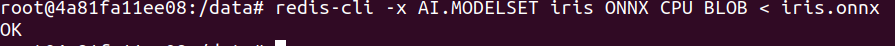

# Iris Classification with RedisAI
Based on:
1) https://youtu.be/-w6rxLyoJdA?t=4
2) https://github.com/guyroyse/redisai-iris

NOTE: Be sure you have installed docker before going further.

## Step 1: RedisAI

Firstly, get prepared redisai image:
```
docker image pull redislabs/redismod
```
Then run the image:
```
docker run -d \
    -p 6379:6379 \
    -v $(pwd):/data \
    --name redis_container \
    redislabs/redismod \
    --loadmodule /usr/lib/redis/modules/redisai.so \
    ONNX redisai_onnxruntime/redisai_onnxruntime.so
```
And, you've got RedisAI up and running!
Let's enter it:
```
docker exec -it redis_container bash
```

## Step 2: try RedisAI cli, define the input tensors:
TENSORSET command:
```
redis-cli AI.TENSORSET iris:in FLOAT 2 4 VALUES 5.0 3.4 1.6 0.4 6.0 2.2 5.0 1.5
```
 

* Note, that you can also set a tensor via AI.TENSORSET iris:in FLOAT 2 4 BLOB "{string_representation}"
 

TENSORGET command:
```
redis-cli AI.TENSORGET iris:in VALUES
```
 

TENSORGET BLOB representation:
```
redis-cli AI.TENSORGET iris:in BLOB
```
 

TENSORGET META information:
```
redis-cli AI.TENSORGET iris:in META
```
 

TENSORGET META information with tensor values:
```
redis-cli AI.TENSORGET iris:in META VALUES
```
 

## Step 3: Load the Model into RedisAI
To load the model use MODELSET:
```
redis-cli -x AI.MODELSET iris ONNX CPU BLOB < iris.onnx
```
 

## Step 4: Run the Model
Define inputs for the loaded model:
```
redis-cli AI.MODELRUN iris INPUTS iris:in OUTPUTS iris:inferences iris:scores
```
 

To get predictions, type:
```
redis-cli AI.TENSORGET iris:inferences VALUES META
```
 
## to Stop/Kill redisai container
Once you've tried the RedisAI, don't forget to kill the running container.
Open up new terminal and type
```
docker rm -f redis_container
```

