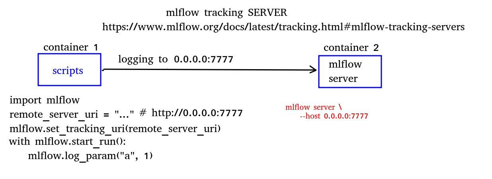
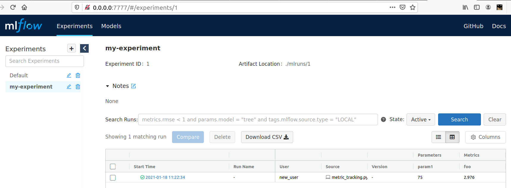

# MLFLOW
## In this example a docker container will be built for using Mlflow as a tracking server
## CLI

1) Build an image:  
```
docker-compose build --build-arg USER_ID=$(id -u) --build-arg GROUP_ID=$(id -g)
```
2) Run containers (Start Mlflow's servevr at port 7777 and track metrics):  
```
docker compose up
```

If you go to 0.0.0.0:7777, then you will see mlflow UI
<p style="text-align:center;">Architecture:</p>

<p style="text-align:center;">UI and results:</p>



If you want to enter the container via docker-compose use:
```
docker-compose run {service_name} bash
```
